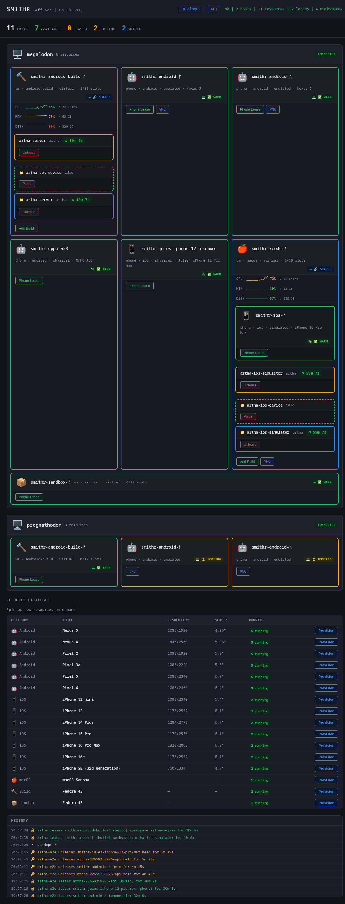
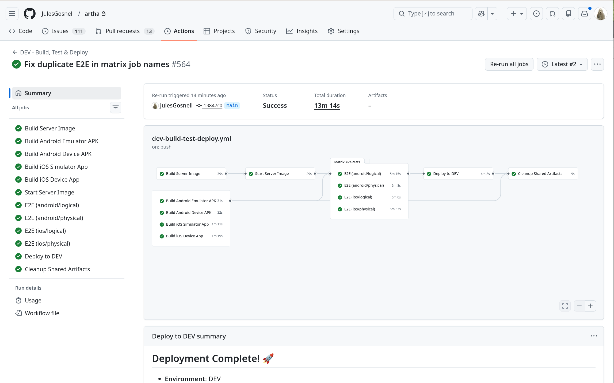

# Smithr

> Resource-as-a-Service for CI, testing, and development.

> [!WARNING]
> **Caveat emptor** — Smithr is just coming out of active development. The edges
> are rough but navigable if you throw your own Claude at it. Documentation may
> be at best incomplete and at worst misleading. That said, it is used 24/7 by
> the author. Proceed with curiosity and a healthy tolerance for surprises.

Smithr enhances Docker with four capabilities that Docker alone doesn't provide:

1. **Location independence** — Resources live on any host. A client on host A
   leases a phone on host B without knowing or caring where it runs. Smithr
   routes SSH tunnels automatically across the cluster.

2. **Leasing** — Acquire exclusive or shared access to a resource for a
   bounded duration. When the lease expires (or the client disconnects),
   Smithr guarantees cleanup and returns the resource to the pool.

3. **Warm resources** — Containers are pre-started and health-checked. Leasing
   is instant — no boot wait, no provisioning delay.

4. **Stickiness** — Named workspaces persist across leases. Lease a sandbox
   called `karl-1`, do work, unlease, re-lease later — your files are still
   there.

Any Docker container can be a Smithr resource. The project includes templates
for common resource types:

- **Emulated phones** — Android emulators (ADB access)
- **Physical phones** — USB-attached Android and iOS devices [^1]
- **Simulated phones** — iOS Simulators inside macOS VMs [^1]
- **macOS + Xcode VMs** — QEMU-hosted macOS for iOS/macOS builds [^1]
- **Physical macOS hardware** — Bare-metal Macs adopted as build resources
- **Build containers** — Fedora + Android SDK for CI builds
- **Dev sandboxes** — Fedora + Claude Code for AI-assisted development
- **Adopted servers** — Any container you own, tunneled transparently

Develop on commodity Linux hardware. Share expensive, specialised resources
— Macs, iPhones, Android phones — transparently.

## Dashboard



## In Production

The CI pipeline below is what Smithr was built to support — five parallel
builds, four concurrent E2E tests across emulated and physical phones, deploy
on green. But because Smithr is built entirely on existing Docker abstractions
(labels, compose, networks), it can do much more than CI.



## Quick Start

Clients get access through a **proxy sidecar** that handles leasing, port
forwarding, and cleanup automatically.

### Lease a phone (Android)

```bash
# Fetch the proxy template (once)
curl -s http://localhost:7070/api/compose/android-phone -o android-phone.yml

# Start — proxy acquires lease and forwards ADB
SMITHR_LESSEE="ci-123" docker compose -f android-phone.yml -p my-phone up -d

# ADB is now available at localhost:5555
adb connect localhost:5555
maestro test flows/

# Stop — proxy unleases automatically
docker compose -f android-phone.yml -p my-phone down
```

### Lease a build workspace (macOS) [^1]

```bash
# Fetch the proxy template (once)
curl -s http://localhost:7070/api/compose/macos-build -o macos-build.yml

# Start — proxy acquires lease and forwards SSH
SMITHR_LESSEE="ci-123" SMITHR_WORKSPACE="my-build" \
  docker compose -f macos-build.yml -p my-build up -d

# Run commands on the remote VM — no SSH keys or ports needed
docker exec my-build-macos-build-1 workspace-ssh "xcodebuild -workspace ..."

# Stop — proxy unleases automatically
docker compose -f macos-build.yml -p my-build down
```

### Lease a dev sandbox

```bash
# Fetch the proxy template (once)
curl -s http://localhost:7070/api/compose/sandbox -o sandbox.yml

# Start — proxy acquires lease and forwards SSH
SMITHR_LESSEE="ci-123" SMITHR_WORKSPACE="karl-1" \
  docker compose -f sandbox.yml -p my-sandbox up -d

# SSH into the sandbox — Claude Code, gh CLI, Android SDK all pre-installed
docker exec my-sandbox-sandbox-1 workspace-ssh "claude --version"

# Stop — proxy unleases automatically
docker compose -f sandbox.yml -p my-sandbox down
```

## Available Templates

| Template | Resource | Forwarded Port | Use Case |
|----------|----------|----------------|----------|
| `android-phone` | Android emulator | `localhost:5555` (ADB) | E2E tests |
| `ios-phone` | iOS Simulator [^1] | `localhost:7001` (Maestro) | E2E tests |
| `macos-build` | macOS + Xcode VM [^1] | `localhost:22` (SSH) | iOS/macOS builds |
| `android-build` | Fedora + Android SDK | `localhost:22` (SSH) | Android builds, E2E |
| `sandbox` | Fedora + Claude Code | `localhost:22` (SSH) | Dev sandboxes |
| `phone` | Android or iOS phone | `localhost:22` (SSH) | Unified phone proxy |
| `server` | Adopted server | `localhost:3000` | E2E tests against an API |
| `adopt-proxy` | External container | configurable | Adopt + tunnel any container |

## Architecture

```
┌──────────────────────────────────────────────────────────┐
│  CI Runner / Client                                      │
│                                                          │
│  docker compose up  │  run tests  │  docker compose down  │
└───────┬────────────────┬───────────────────────────┬─────┘
        │                │                           │
   ┌────▼────┐    ┌──────▼──────┐              ┌─────▼─────┐
   │ Smithr  │    │ Proxy       │              │ Proxy     │
   │ API     │◄───│ Container   │──socat──────►│ Container │
   │ :7070   │    │ (lease+fwd) │              │ (cleanup) │
   └────┬────┘    └─────────────┘              └───────────┘
        │
   ┌────▼───────────────────────────────────────────┐
   │  Smithr Control Plane (Clojure)                │
   │  - Docker event subscription (push-based)      │
   │  - Lease state (Clojure atom)                  │
   │  - SSH tunnel management                       │
   │  - GC loop (reaps expired leases every 30s)    │
   │  - Dashboard (Reagent SPA on :7070)            │
   └────┬───────────────────────────────────────────┘
        │
   ┌────▼──────────┐  ┌────────────────┐
   │  Host A        │  │  Host B        │
   │  Docker host   │  │  Docker host   │
   └───────────────┘  └────────────────┘
```

Smithr discovers resources via Docker labels (`smithr.managed=true`) using
push-based event subscription. Resources are served warm across hosts with
automatic SSH tunnel routing.

## Key Concepts

- **Resources** — Any Docker container with `smithr.managed=true` labels.
- **Leases** — Exclusive (phones) or shared (builds/sandboxes) access. SSH tunnels created on lease, destroyed on unlease.
- **Workspaces** — Named persistent environments (e.g., `karl-1`). State survives across leases.
- **Proxy sidecar** — Lightweight Alpine container handling lease lifecycle and port forwarding.
- **Adopt** — Register any external container as a leasable Smithr resource.

## Environment Variables

| Variable | Default | Description |
|----------|---------|-------------|
| `SMITHR_LESSEE` | `anonymous` | Who owns this lease (for tracking) |
| `SMITHR_TTL` | `3600` | Lease duration in seconds |
| `SMITHR_WORKSPACE` | — | Named persistent workspace (build leases) |

## Running Smithr

```bash
# From project root
clojure -M:run

# Or via Docker Compose
docker compose -f layers/network.yml -f layers/server.yml up -d
```

Dashboard at `http://localhost:7070/`.

## Requirements

- Linux (Fedora 43 recommended)
- Docker with Compose v2
- Clojure 1.12+ (control plane)
- KVM (`/dev/kvm`) for Android emulators and macOS VMs [^1]
- 16+ GB RAM (64 GB recommended for phone pools)

## License

See [LICENSE](LICENSE).

[^1]: Smithr does not download, build, or distribute macOS or any Apple software. The macOS VM template orchestrates a user-supplied container image via Docker and SSH. It is the user's responsibility to ensure compliance with Apple's EULA, which requires macOS virtualisation to run on Apple hardware.
